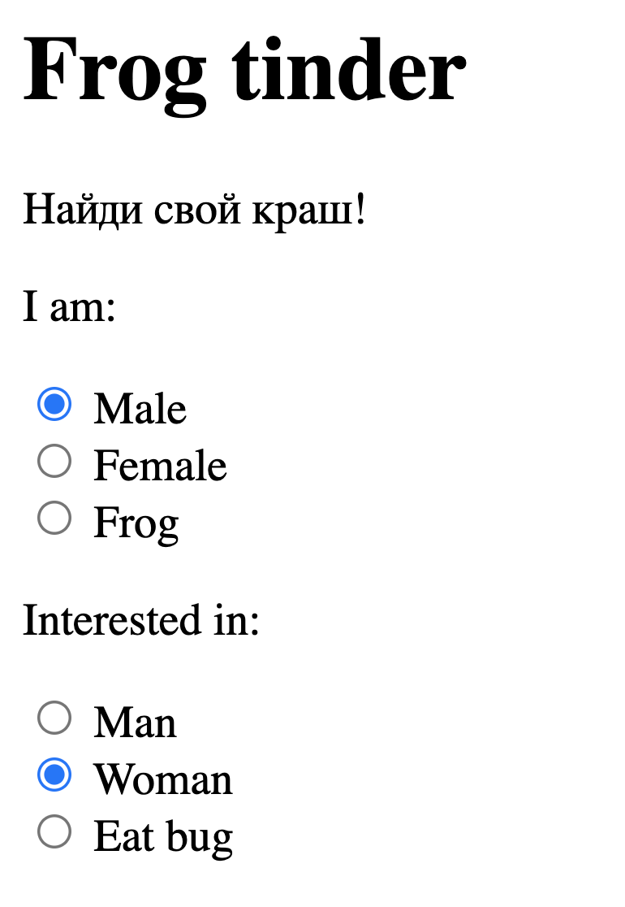

## Frog tinder. Знакомство с  `input type="radio"`,

Теперь ты можешь выполнить еще одну практическую задачу. При помощи HTML можно создавать различные формы регистрации. 

Подробнее познакомиться с радио-кнопками можно [тут](https://developer.mozilla.org/en-US/docs/Web/HTML/Element/input/radio).

Создай файл `index.html` и работай в нем.

*Помни: каждый релиз = отдельный коммит (commit).*

[//]: # (![Вдохновение]&#40;frogs.jpeg "frogs"&#41;)

  
Что нужно сделать:  

[//]: # (![Курсы валют]&#40;exmpl.png "Frog tinder"&#41;)

### Релиз 0.
Создай заголовок и текст.

### Релиз 1.
Создай первую часть опроса "I am: Man, Woman, Frog". Убедись, что можно выбрать только одно значение. Не забудь про атрибуты id="" name="" value="".

### Релиз 2.
Добавь вторую часть опроса "Interested in: Man, Woman, Eat bugs". Убедись, что можно выбрать только одно значение из каждого опроса.

*Отлично! Теперь сделай "Pull request" своего проекта прежде, чем приступать к следующему заданию.*
